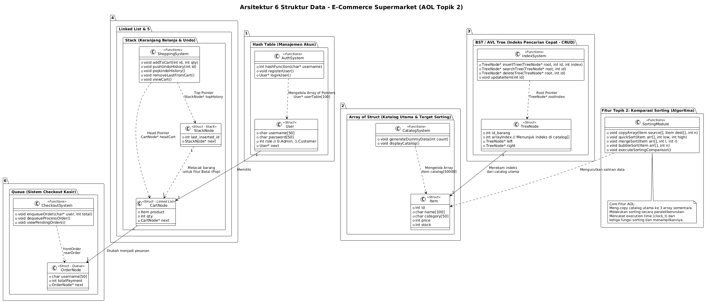
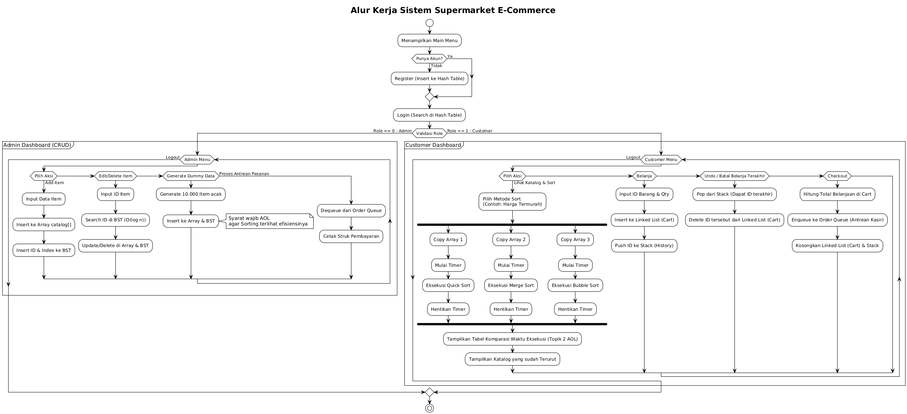
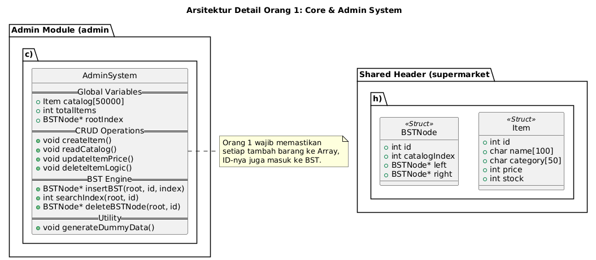
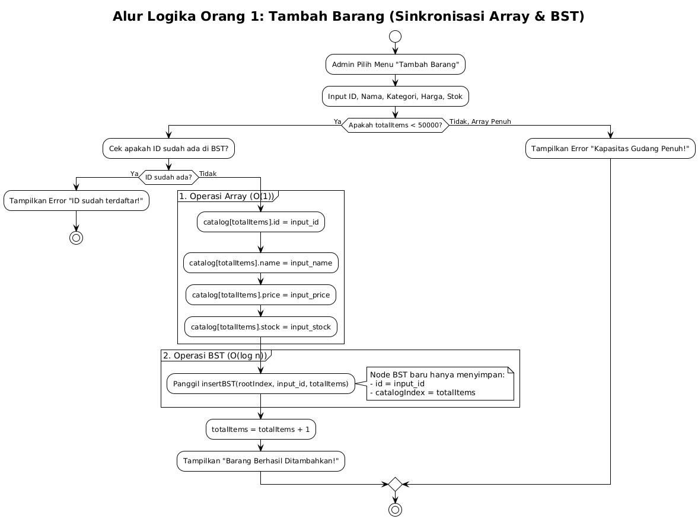
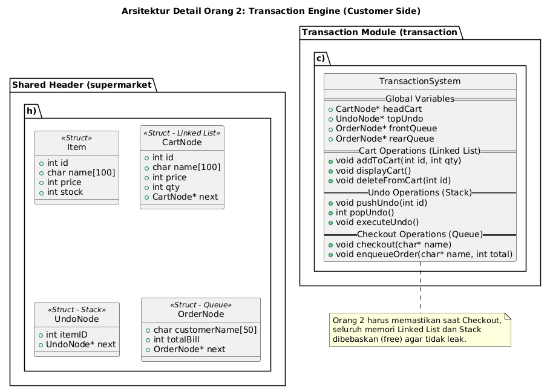
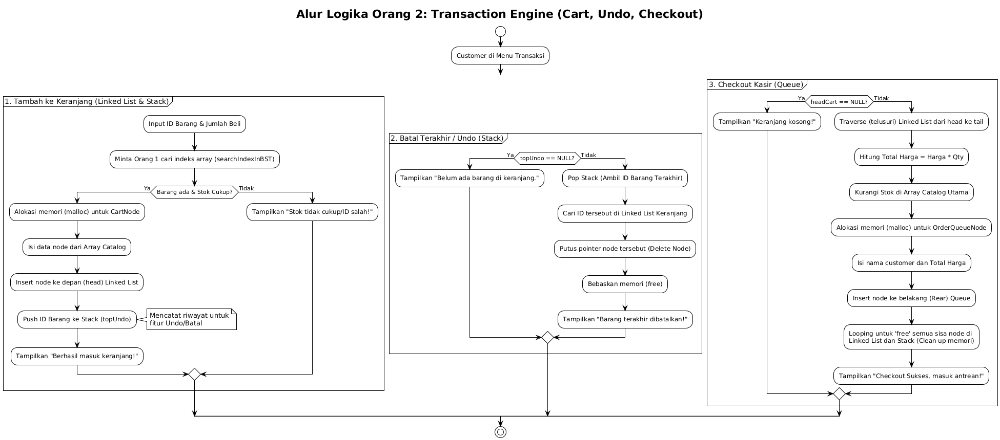
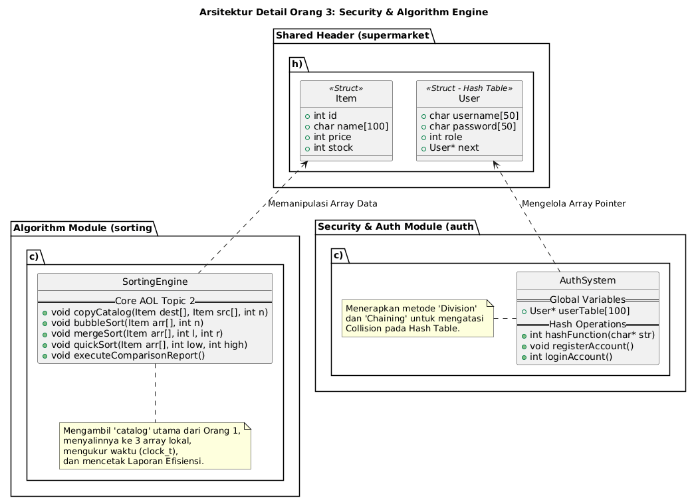
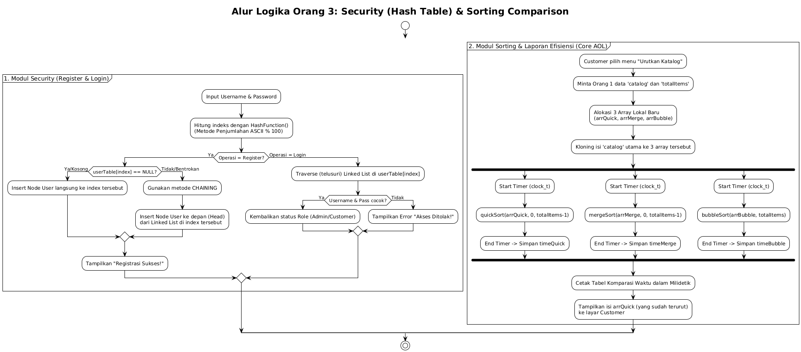

# UML dari E-Market

## Arsitektur utama

## Pseudoode uatam:

## Arsitekturr orang 1:

## Pseudocode orang 1:

## Arsitekturr orang 2:

## Pseudocode orang 2:

## Arsitekturr orang 3:

## Pseudocode orang 3:

